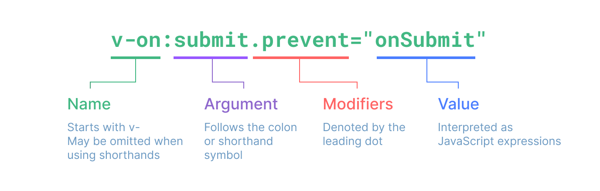

## 什么是 Vue？​

Vue (发音为 /vjuː/，类似 view) 是一款用于构建用户界面的 JavaScript 框架。它基于标准 HTML、CSS 和 JavaScript 构建，并提供了一套声明式的、组件化的编程模型，帮助你高效地开发用户界面。

## 两种 API：选项式 & 组合式

- 选项式 API 以“组件实例”的概念为中心 (this 即为 Vue 实例)，对于有面向对象语言背景的用户来说，这通常与基于类的心智模型更为一致。同时，它将响应性相关的细节抽象出来，并强制按照选项来组织代码，从而对初学者而言更为友好。
- 组合式 API 的核心思想是直接在函数作用域内定义响应式状态变量，并将从多个函数中得到的状态组合起来处理复杂问题。这种形式更加自由，也需要你对 Vue 的响应式系统有更深的理解才能高效使用。相应的，它的灵活性也使得组织和重用逻辑的模式变得更加强大。

## 什么是组合式 API？​

组合式 API (Composition API) 是一系列 API 的集合，使我们可以使用函数而不是声明选项的方式书写 Vue 组件。它是一个概括性的术语，涵盖了以下方面的 API：

- 1、响应式 API：例如 ref() 和 reactive()，使我们可以直接创建响应式状态、计算属性和侦听器。
- 2、生命周期钩子：例如 onMounted() 和 onUnmounted()，使我们可以在组件各个生命周期阶段添加逻辑。
- 3、依赖注入：例如 provide() 和 inject()，使我们可以在使用响应式 API 时，利用 Vue 的依赖注入系统。

## 为什么要有组合式 API？​

### 1、更好的逻辑复用 ​

组合式 API 最基本的优势是它使我们能够通过组合函数来实现更加简洁高效的逻辑复用。在选项式 API 中我们主要的逻辑复用机制是 mixins，而组合式 API 解决了 mixins 的所有缺陷。

### 2、更灵活的代码组织

选项式 API 在需要处理多个逻辑关注点的组件中，同一个逻辑关注点相关的代码写在不同的选项块，而在组合式 API 中同一个逻辑关注点相关的代码被归为了一组：我们无需再为了一个逻辑关注点在不同的选项块间来回滚动切换。此外，我们现在可以很轻松地将这一组代码移动到一个外部文件中，不再需要为了抽象而重新组织代码，大大降低了重构成本，这在长期维护的大型项目中非常关键。

### 3、更好的类型推导

组合式 API 主要利用基本的变量和函数，它们本身就是类型友好的。用组合式 API 重写的代码可以享受到完整的类型推导，不需要书写太多类型标注。大多数时候，用 TypeScript 书写的组合式 API 代码和用 JavaScript 写都差不太多！这也让许多纯 JavaScript 用户也能从 IDE 中享受到部分类型推导功能。

### 4、更小的生产包体积 ​

搭配 `<script setup>` 使用组合式 API 比等价情况下的选项式 API 更高效，对代码压缩也更友好。这是由于 `<script setup>` 形式书写的组件模板被编译为了一个内联函数，和 `<script setup>` 中的代码位于同一作用域。不像选项式 API 需要依赖 this 上下文对象访问属性，被编译的模板可以直接访问 `<script setup>` 中定义的变量，无需从实例中代理。这对代码压缩更友好，因为本地变量的名字可以被压缩，但对象的属性名则不能。

## 与选项式 API 的关系

组合式 API 不像选项式 API 那样会手把手教你该把代码放在哪里。但反过来，它却让你可以像编写普通的 JavaScript 那样来编写组件代码。这意味着**你能够，并且应该在写组合式 API 的代码时也运用上所有普通 JavaScript 代码组织的最佳实践**。如果你可以编写组织良好的 JavaScript，你也应该有能力编写组织良好的组合式 API 代码。选项式 API 确实允许你在编写组件代码时“少思考”，这是许多用户喜欢它的原因。然而，在减少费神思考的同时，它也将你锁定在规定的代码组织模式中，没有摆脱的余地，这会导致在更大规模的项目中难以进行重构或提高代码质量。在这方面，组合式 API 提供了更好的长期可维护性。

## 模板语法

### 简写

```html
<!-- 属性 -->
<div :id="dynamicId"></div>

<!-- 属性和值都是id -->
<div :id></div>

<!-- 事件 -->
<a @click="doSomething"></a>

<!-- 动态参数 -->
<a :[attributeName]="url"> ... </a>
```

### 完整的指令语法



## 响应式基础

ref() 接收参数，并将其包裹在一个带有 .value 属性的 ref 对象中返回，reactive() 将使对象本身具有响应性。当 ref 的值是一个对象时，ref() 也会在内部调用 reactive()。

### 为什么要使用 ref？

在标准的 JavaScript 中，检测普通变量的访问或修改是行不通的。然而，我们可以通过 getter 和 setter 方法来拦截对象属性的 get 和 set 操作。该 .value 属性给予了 Vue 一个机会来检测 ref 何时被访问或修改。在其内部，Vue 在它的 getter 中执行追踪，在它的 setter 中执行触发。

### reactive() 的局限性

1、有限的值类型：它只能用于对象类型 (对象、数组和如 Map、Set 这样的集合类型)。它不能持有如 string、number 或 boolean 这样的原始类型。
2、不能替换整个对象：由于 Vue 的响应式跟踪是通过属性访问实现的，因此我们必须始终保持对响应式对象的相同引用。

```js
let state = reactive({ count: 0 });

// 上面的 ({ count: 0 }) 引用将不再被追踪
// (响应性连接已丢失！)
state = reactive({ count: 1 });
```

3、对解构操作不友好：当我们将响应式对象的原始类型属性解构为本地变量时，或者将该属性传递给函数时，我们将丢失响应性连接：

```js
const state = reactive({ count: 0 });

// 当解构时，count 已经与 state.count 断开连接
let { count } = state;
// 不会影响原始的 state
count++;

// 该函数接收到的是一个普通的数字
// 并且无法追踪 state.count 的变化
// 我们必须传入整个对象以保持响应性
callSomeFunction(state.count);
```

由于这些限制，我们建议使用 ref() 作为声明响应式状态的主要 API。

### 额外的 ref 解包细节

#### 作为 reactive 对象的属性 ​

一个 ref 会在作为响应式对象的属性被访问或修改时自动解包。换句话说，它的行为就像一个普通的属性：

```js
const count = ref(0);
const state = reactive({
  count,
});

console.log(state.count); // 0

state.count = 1;
console.log(count.value); // 1
```

如果将一个新的 ref 赋值给一个关联了已有 ref 的属性，那么它会替换掉旧的 ref：

```js
const otherCount = ref(2);

state.count = otherCount;
console.log(state.count); // 2
// 原始 ref 现在已经和 state.count 失去联系
console.log(count.value); // 1
```

只有当嵌套在一个深层响应式对象内时，才会发生 ref 解包。当其作为浅层响应式对象的属性被访问时不会解包。

#### reactive 数组和集合的注意事项 ​

与 reactive 对象不同的是，当 ref 作为响应式数组或原生集合类型 (如 Map) 中的元素被访问时，它不会被解包：

```js
const books = reactive([ref("Vue 3 Guide")]);
// 这里需要 .value
console.log(books[0].value);

const map = reactive(new Map([["count", ref(0)]]));
// 这里需要 .value
console.log(map.get("count").value);
```

#### 在模板中解包的注意事项 ​

在模板渲染上下文中，只有顶级的 ref 属性才会被解包。

在下面的例子中，count 和 object 是顶级属性，但 object.id 不是：

```js
const count = ref(0);
const object = { id: ref(1) };
```

因此，这个表达式按预期工作：

```template
{{ count + 1 }}
```

...但这个不会：

```template
{{ object.id + 1 }}
```

渲染的结果将是 [object Object]1，因为在计算表达式时 object.id 没有被解包，仍然是一个 ref 对象。为了解决这个问题，我们可以将 id 解构为一个顶级属性：

```js
const { id } = object;
```

```template
{{ id + 1 }}
```

现在渲染的结果将是 2。

另一个需要注意的点是，如果 ref 是文本插值的最终计算值 (即 {{ }} 标签)，那么它将被解包，因此以下内容将渲染为 1：

```template
{{ object.id }}
```

该特性仅仅是文本插值的一个便利特性，等价于 {{ object.id.value }}。

## 计算属性

computed() 方法期望接收一个 getter 函数，返回值为一个计算属性 ref。

## 生命周期


## 侦听器

### watch 的第一个参数可以是不同形式的“数据源”：它可以是一个 ref (包括计算属性)、一个响应式对象、一个 getter 函数、或多个数据源组成的数组

```js
const x = ref(0);
const y = ref(0);

// 单个 ref
watch(x, (newX) => {
  console.log(`x is ${newX}`);
});

// getter 函数
watch(
  () => x.value + y.value,
  (sum) => {
    console.log(`sum of x + y is: ${sum}`);
  }
);

// 多个来源组成的数组
watch([x, () => y.value], ([newX, newY]) => {
  console.log(`x is ${newX} and y is ${newY}`);
});
```

#### 直接给 watch() 传入一个响应式对象，会隐式地创建一个深层侦听器——该回调函数在所有嵌套的变更时都会被触发

```js
const obj = reactive({ count: 0 });

watch(obj, (newValue, oldValue) => {
  // 在嵌套的属性变更时触发
  // 注意：`newValue` 此处和 `oldValue` 是相等的
  // 因为它们是同一个对象！
});

obj.count++;
```

#### watchEffect() 允许我们自动跟踪回调的响应式依赖，对于有多个依赖项的侦听器来说，使用 watchEffect() 可以消除手动维护依赖列表的负担

> 如果你需要侦听一个嵌套数据结构中的几个属性，watchEffect() 可能会比深度侦听器更有效，因为它将只跟踪回调中被使用到的属性，而不是递归地跟踪所有的属性。

#### watch vs. watchEffect​

- watch 和 watchEffect 都能响应式地执行有副作用的回调。它们之间的主要区别是追踪响应式依赖的方式：
- watch 只追踪明确侦听的数据源。它不会追踪任何在回调中访问到的东西。另外，仅在数据源确实改变时才会触发回调。watch 会避免在发生副作用时追踪依赖，因此，我们能更加精确地控制回调函数的触发时机。
- watchEffect，则会在副作用发生期间追踪依赖。它会在同步执行过程中，自动追踪所有能访问到的响应式属性。这更方便，而且代码往往更简洁，但有时其响应性依赖关系会不那么明确。

## 插槽

### 插槽内容与出口

`<slot>` 元素是一个插槽出口 (slot outlet)，标示了父元素提供的插槽内容 (slot content) 将在哪里被渲染。


最终渲染出的 DOM 是这样：

```html
<button class="fancy-btn">Click me!</button>
```

### 渲染作用域 ​

插槽内容可以访问到父组件的数据作用域，因为插槽内容本身是在父组件模板中定义的。

### 默认内容

在外部没有提供任何内容的情况下，可以为插槽指定默认内容。比如有这样一个 `<SubmitButton>` 组件：

```html
<button type="submit">
  <slot></slot>
</button>
```

如果我们想在父组件没有提供任何插槽内容时在 `<button>` 内渲染“Submit”，只需要将“Submit”写在 `<slot>` 标签之间来作为默认内容：

```html
<**button** type="submit">
  <slot>
    Submit
    <!-- 默认内容 -->
  </slot>
</button>
```

### 具名插槽

`<slot>` 元素可以有一个特殊的 attribute `name`，用来给各个插槽分配唯一的 ID，以确定每一处要渲染的内容：

```html
<div class="container">
  <header>
    <slot name="header"></slot>
  </header>
  <main>
    <slot></slot>
  </main>
  <footer>
    <slot name="footer"></slot>
  </footer>
</div>
```

这类带 name 的插槽被称为具名插槽 (named slots)。没有提供 name 的 <slot> 出口会隐式地命名为“default”。

要为具名插槽传入内容，我们需要使用一个含 `v-slot` 指令的 `<template>` 元素，并将目标插槽的名字传给该指令：

```html
<BaseLayout>
  <template v-slot:header>
    <!-- header 插槽的内容放这里 -->
  </template>
</BaseLayout>
```

`v-slot` 有对应的简写 `#`，因此 `<template v-slot:header>` 可以简写为 `<template #header>`。其意思就是“将这部分模板片段传入子组件的 header 插槽中”。(当一个组件同时接收默认插槽和具名插槽时，所有位于顶级的非 `<template>` 节点都被隐式地视为默认插槽的内容。)


### 动态插槽名

动态指令参数在 `v-slot` 上也是有效的，即可以定义下面这样的动态插槽名：

```html
<base-layout>
  <template v-slot:[dynamicSlotName]> ... </template>

  <!-- 缩写为 -->
  <template #[dynamicSlotName]> ... </template>
</base-layout>
```

### 作用域插槽

当插槽需要使用子组件域内的数据，可以像对组件传递 props 那样，向一个插槽的出口上传递 attributes：

```html
<!-- <MyComponent> 的模板 -->
<div>
  <slot :text="greetingMessage" :count="1"></slot>
</div>
```

当需要接收插槽 props 时，默认插槽通过子组件标签上的 v-slot 指令，直接接收到了一个插槽 props 对象：

```html
<MyComponent v-slot="slotProps">
  {{ slotProps.text }} {{ slotProps.count }}
</MyComponent>
```

子组件传入插槽的 props 作为了 v-slot 指令的值，可以在插槽内的表达式中访问。

具名作用域插槽的工作方式也是类似的，插槽 props 可以作为 `v-slot` 指令的值被访问到：`v-slot:name="slotProps"`。当使用缩写时是这样：

```html
<MyComponent>
  <template #header="headerProps"> {{ headerProps }} </template>
</MyComponent>
```

向具名插槽中传入 props：

```html
<slot name="header" message="hello"></slot>
```

### 高级列表组件示例 ​

什么样的场景才适合用到作用域插槽? 这里我们来看一个 `<FancyList>` 组件的例子。它会加载远端数据并进行列表渲染，而单个列表元素内容和样式的控制权留给使用它的父组件：

```html
<FancyList :api-url="url" :per-page="10">
  <template #item="{ body, username, likes }">
    <div class="item">
      <p>{{ body }}</p>
      <p>by {{ username }} | {{ likes }} likes</p>
    </div>
  </template>
</FancyList>
```

在 `<FancyList>` 之中，我们可以多次渲染 `<slot>` 并每次都提供不同的数据 (注意我们这里使用了 v-bind 来传递插槽的 props)：

```html
<ul>
  <li v-for="item in items">
    <slot name="item" v-bind="item"></slot>
  </li>
</ul>
```

### 无渲染组件 ​

上面的 `<FancyList>` 案例同时封装了可重用的逻辑 (数据获取、分页等) 和视图输出，但也将部分视图输出通过作用域插槽交给了消费者组件来管理。
如果我们将这个概念拓展一下，一些组件可能只包括了逻辑而不需要自己渲染内容，视图输出通过作用域插槽全权交给了消费者组件。我们将这种类型的组件称为无渲染组件。

## 依赖注入

## 异步组件

## 组合式函数

在 Vue 应用的概念中，“组合式函数”(Composables) 是一个利用 Vue 的组合式 API 来封装和复用**有状态逻辑**的函数，有状态逻辑负责管理会随时间而变化的状态。一个简单的例子是跟踪当前鼠标在页面中的位置。在实际应用中，也可能是像触摸手势或与数据库的连接状态这样的更复杂的逻辑。（无状态的逻辑：接收一些输入后立刻返回所期望的输出，如日期格式化，lodash 等）
